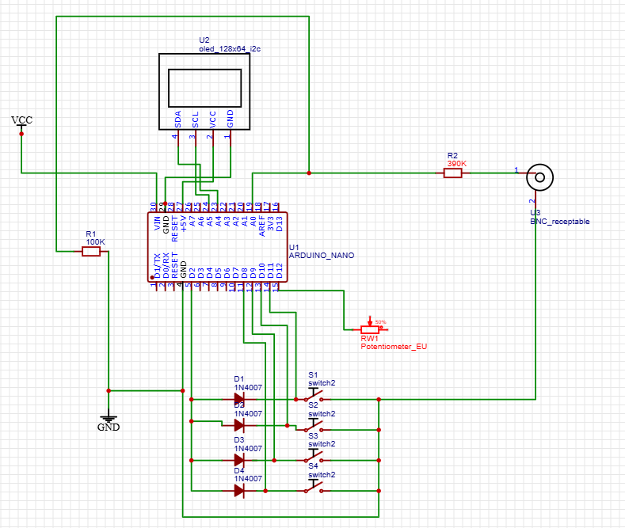

# 🔬 DIY Digital OLED Oscilloscope (Under Construction)

An ongoing, high-performance embedded systems project aimed at building a portable digital storage oscilloscope (DSO) using an **Arduino Nano** and an **I2C OLED display (128x64)**. 

> ⚠️ **Project Status: Work in Progress (WIP).** The hardware schematic is finalized, core sampling algorithms are being optimized, and UI components are under active development.

---

## 🛠️ System Architecture & Schematic
The current design focuses on squeezing maximum sampling performance out of the ATmega328P microcontroller by bypassing standard framework limitations.

### Circuit Schematic

### Core Hardware Components:
* **MCU:** Arduino Nano (ATmega328P) operating at 16MHz.
* **Display:** 128x64 OLED via I2C interface (SDA/SCL) for real-time waveform visualization.
* **Analog Front-End:** High-impedance input signal conditioning network with a BNC receptacle.
* **Control Interface:** A multi-switch matrix with diode protection for hardware interrupts (triggering, timebase adjustment, and voltage scaling).

---

## 🚀 Theoretical Engineering Challenges

To make this a viable oscilloscope, the project tackles several microelectronic and low-level firmware bottlenecks:

### 1. ADC Prescaler Optimization
The default Arduino `analogRead()` takes about 100µs (~10kHz sample rate), which is too slow for an oscilloscope. By directly manipulating the ADCSRA register, the ADC prescaler is being reconfigured (from 128 down to 32 or 16) to achieve a **sampling rate of up to 50kHz - 100kHz** without sacrificing critical vertical resolution.

### 2. Hardware Triggering & Interfacing
Using an external switch matrix routed through input pins to handle timebase and voltage per division scaling dynamically. The implementation utilizes internal pull-ups and diode-isolated paths to guarantee clean signal edge detection.

### 3. Fast Screen Refresh (I2C Overclocking)
Standard I2C runs at 100kHz. To display waveforms smoothly without lagging the ADC sampling loop, the I2C clock frequency is boosted to **400kHz (Fast Mode)** by tweaking the `TWBR` (Two Wire Bit Rate Register).

---
